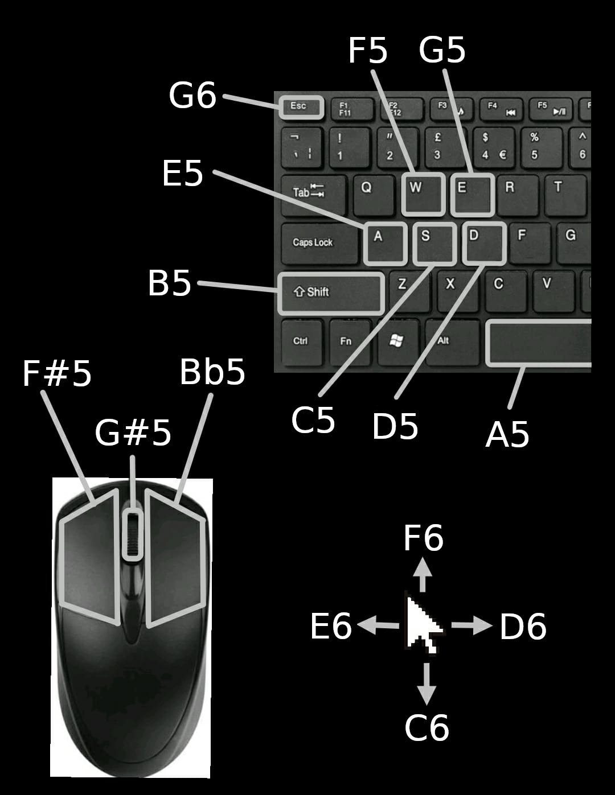

# Audio to Minecraft

This is a short python project which maps musical notes from the device's microphone to keyboard inputs for the game Minecraft.

## Usage
The project is a one-filer meaning one can simply run it through python:

```sh
python audio-to-minecraft.py
```

Once run in a console/terminal, it will start to listen to the input from the system microphone, and take control of the mouse and keyboard but not inhibit user input.

Whenever the program hears a musical note between C5 (523Hz, printed as `C`) and B6 (1976Hz, printed as `B'`), it compares it against a hard-coded table and simulates the corresponding mouse or keyboard input. The reason for this specific frequency range is that it coincides nicely with the range of a usual school recorder.

To exit the program, either close the terminal emulator or press Ctrl+C on your keyboard while on the window. If such is not possible, one can forcefully crash it by moving the mouse to the edge of the screen as a failsafe.

### Default controls

This is the hard-coded control scheme in the current version:
- The note C5 moves the player backward (maps to the S key).
- The note D5 moves the player to the right (maps to the D key).
- The note E5 moves the player to the left (maps to the A key).
- The note F5 moves the player forward (maps to the F key).
- The note F#5 breaks a block (maps to left-click).
- The note G5 opens the inventory (maps to the E key).
- The note G#5 cycles through hotbar slots (maps to the scroll-wheel).
- The note A5 makes the player jump (maps to the spacebar).
- The note Bb5 places a block (maps to right-click).
- The note B5 makes the player sneak (maps to the shift key).
- The note C6 moves the camera/cursor downward.
- The note D6 moves the camera/cursor to the right.
- The note E6 moves the camera/cursor to the left.
- The note F6 moves the camera/cursor upward.
- The note G6 opens the exit menu (maps to the escape key).

A cheatsheet made in about 5 minutes to better visualize the controls is provided:



## Recommendations

To use this project inside the game Minecraft, it is highly recommended to turn off raw input in the game's configuration. The way to do so varies by version, but the option is generally found under Configuration > Controls > Mouse Controls.

Additionally, it is recommended to have the shift key behavior set to "Toggle". This is not necessary but allows the program to sneak for more than a split second.

It is also handy to have a way to turn off the microphone, such as a dedicated button or shortcut.

## Dependencies
In order to be able to execute it, the following python modules are required:
- `pyautogui`
- `pyaudio`
- `numpy`

as well as python 3.3 or newer. 

## Compatibility
The program should run on any operating system but it has only been properly tested on Debian 11 and Arch Linux. If you cannot run it in your system despite meeting the requirements, be sure to issue it.

## Future additions

I might add the following features to the project at another time:

- Support to freely change the control mapping.
- Configuration to let the user change values such as the recording frequency or FFT chunk size.

## Known issues and bugs

- Adjacent frequncies (differing in 1 semitone) collide somewhat.
- The failsafe from within `pyautogui` does not always trigger.